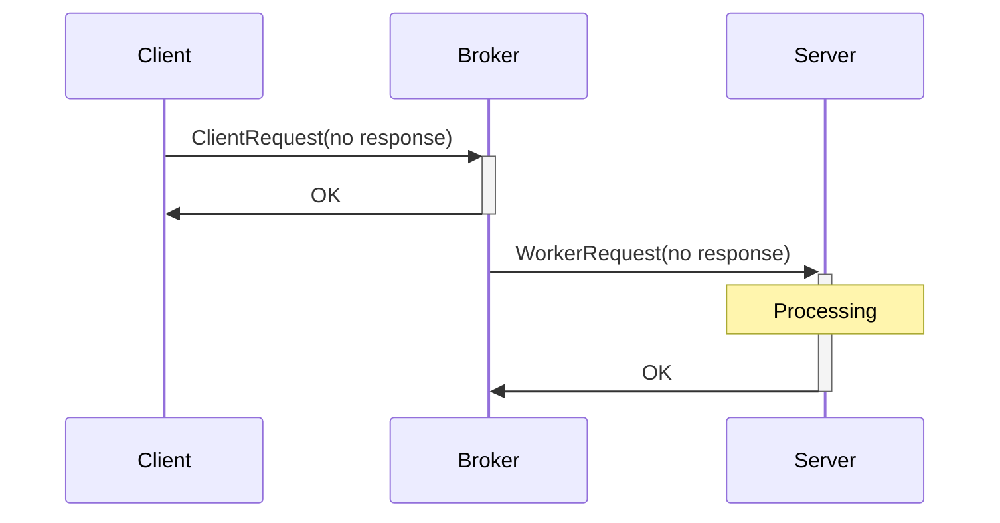

# Getting Started

```mermaid
sequenceDiagram
    Client->>+Broker: ClientRequest(no response)
    Broker->>-Client: OK
    Broker->>+Server: WorkerRequest(no response)
    Note over Server: Processing
    Server->>-Broker: OK
```
